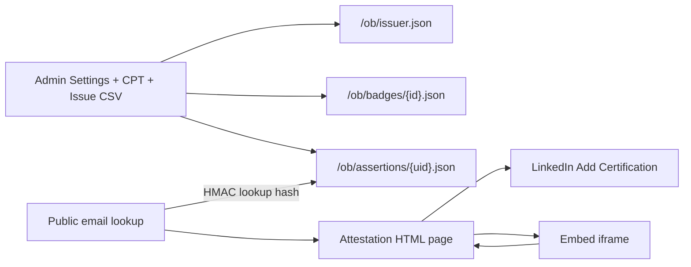

# Fenton Digital Badges

WordPress plugin for issuing, managing, and displaying [Open Badges 1.0](https://github.com/mozilla/openbadges-specification/blob/master/Assertion/latest.md) credentials.

## Install

1. Copy this folder into `wp-content/plugins/fenton-digital-badges`
2. Activate **Fenton Digital Badges** in wp-admin → Plugins
3. Open **Badges → Settings** and configure the issuing organization
4. Create badges (featured image required), then use **Issue Badges** with a CSV

## Architecture



| Open Badges object | Storage | Public URL |
|--------------------|---------|------------|
| IssuerOrganization | `fenton_digital_badges_issuer` option | `/ob/issuer.json` |
| BadgeClass | `db_badge` CPT + meta | `/ob/badges/{id}.json` |
| Assertion | `{prefix}db_assertions` table | `/ob/assertions/{uid}.json` |

## Open Badges endpoints

| Resource | URL |
|----------|-----|
| Issuer | `/ob/issuer.json` |
| BadgeClass | `/ob/badges/{id}.json` |
| Assertion | `/ob/assertions/{uid}.json` |
| Find badges | `/badges/find/` or `[fenton_digital_badges_find]` (optional page template via **Badges → Settings**) |
| Attestation | `/badges/assertion/{uid}/` |
| Embed | `/badges/embed/{uid}/` |

Theme overrides for plugin views: `fenton-digital-badges/{view}.php` (e.g. `find.php`, `attestation.php`).

## Issuing

CSV columns: `email` (required), `name`, `evidence`, `expires` (YYYY-MM-DD). A header row is optional — a single line like `you@example.com,Your Name` works.

Email addresses are salted/hashed for the assertion identity and looked up via a separate HMAC. Plaintext emails are never stored. The public find form always shows the same confirmation message; when matches exist, attestation URLs are emailed to the address.

## Structure

```
fenton-digital-badges.php          Bootstrap + plugin header
readme.txt                  WordPress.org plugin directory listing
license.txt                 GPLv2 (or later)
includes/                   Core classes (issuer, assertions, OB endpoints)
admin/                      Admin UI, settings, assets
public/                     Front-end assets, shortcodes, views
uninstall.php               Cleanup on uninstall
```

## Package

```bash
./package.sh              # bump patch, sync versions, create ZIP
./package.sh --bump minor # bump minor instead
./package.sh --set 1.0.0  # set an explicit version
./package.sh --no-bump    # package without changing the version
```

Creates `dist/fenton-digital-badges-{version}.zip` for manual install or WordPress.org submission. Updates `fenton-digital-badges.php` and `readme.txt` Stable tag when bumping.

## Requirements

- WordPress 6.2+
- PHP 8.0+
